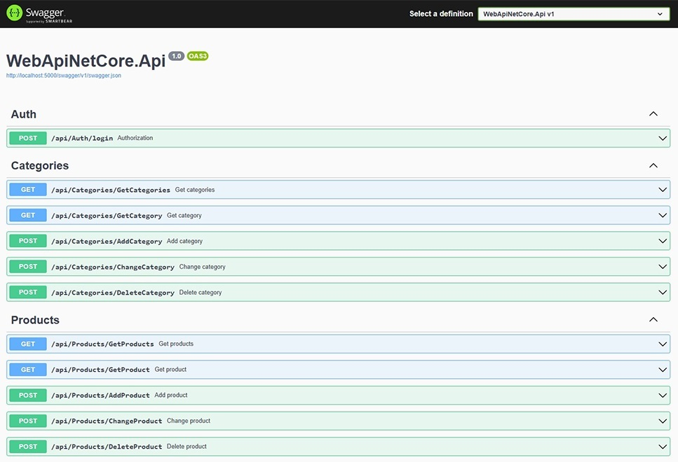

# Project Title

.Net Core RESTful API

## Description

Sample project for REST API with Swagger
* API Services: WebApiNetCore.Api
* API Client: WebApiNetCore.Web

## Authors

[Andro Gaprindashvili](https://github.com/AGaprindashvili)

## Getting Started

* Restore backup file in Microsoft SQL Server (WebApiNetCore/Sql/WebApi.bak)
* Open the project in Visual Studio and run it
* Call the method api/Auth/login
* Login with Username/Password (admin/123) and get a token (tokens expire after 1 hour)
* Call any given method (add authorization token in request header)

### Prerequisites
* .Net Core 8.0
* Visual Studio
* Microsoft SQL Server

